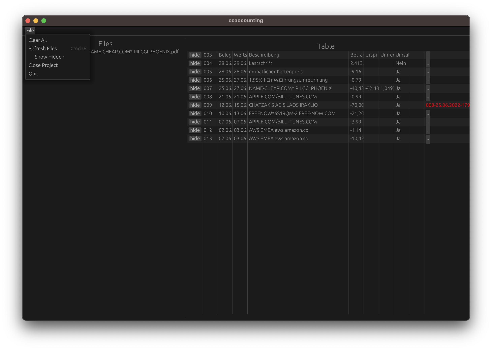

# ccaccounting app

Simple app to assign each credit card expense on your card statement (as CSV) an invoice and simplifies renaming these invoices to easily find them again and for the sanity of your accounting. Load up CSV (right now only miles and more format supported) and start assigning PDFs:

# TODOs

* [ ] support windows/linux
* [ ] allow hiding files in list
* [ ] allow configuring the colums used in filename
* [ ] allow hiding columns
* [ ] allow dropping in entire row

# attribution

* icon based on work by [ProSymbols](https://thenounproject.com/prosymbols/)